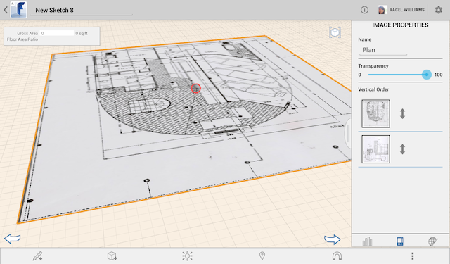

# Importieren und Ändern von Geländeüberlagerungsbildern

---

Erfassen Sie Bilder für den Arbeitsbereich Ihres Entwurfs und ändern Sie sie nötigenfalls.

## Importieren von Geländeüberlagerungsbildern

1. Wählen Sie die Schaltfläche Importieren im Werkzeugkasten unten, um ein Bild zu importieren.

1. Wählen Sie ein Bild aus Ihrer Filmrolle oder Ihrem Foto-Stream.

Das Bild wird automatisch in den Ansichtsbereich importiert.

## Ändern von Geländeüberlagerungsbildern

1. Verwenden Sie die Palette auf der rechten Seite des Bildschirms, um Bildeigenschaften zu ändern.
2. In der Palette können Sie den Namen und die Transparenz des Bilds bearbeiten.
3. Durch Ziehen und Ablegen im Bereich Vertikale Anordnung können Sie die Positionierung (Reihenfolge) aller Geländeüberlagerungsbilder einschließlich importierter Satellitenbilder (sofern vorhanden) festlegen.

