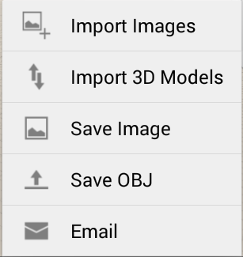

# Importieren von 3D-Modellen und Bildern

---

Sie können Ihren Entwürfen für eine Reihe von Verwendungszwecken Überlagerungen und Bilder hinzufügen.

Bilder oder vorhandene 3D-Modelle ergänzen Ihre Skizze um zusätzliche Informationen.

1. Wählen Sie ein Bild oder ein 3D-Modell aus Ihrem lokalen oder A360-Speicher.

Sie können das Bild skalieren und zuschneiden. Das Bild wird dann in den Arbeitsbereich importiert.

1. Verwenden Sie die Palette auf der rechten Seite des Bildschirms, um Bildeigenschaften zu ändern.

Bearbeiten Sie gegebenenfalls den Namen und die Transparenz des Bildes. Die verschiedenen Geländeüberlagerungen, darunter das Satellitenbild, können auf unterschiedliche Weise übereinander angeordnet werden.

* Sie können Geometrie in den Formaten OBJ oder AXM aus Ihrem lokalen Dateisystem importieren. Tippen Sie einfach im Werkzeugkasten auf das Symbol Importieren, und klicken Sie auf 3D-Modell importieren. Anmerkung: Sie können OBJ- oder AXM-Dateien auch aus Ihrem System in den Arbeitsbereich ziehen und dort ablegen.

