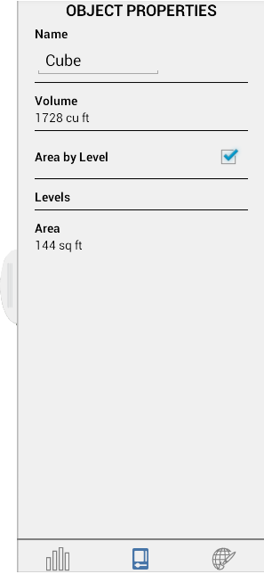

# Ebenen und Flächennutzung

---

Zeigen Sie Flächenberechnungen für Objekte in einem Entwurf an.

## Ebenen aktivieren

1. Klicken Sie auf Einstellungen, und aktivieren Sie dann Ebene anzeigen.

2. Klicken Sie auf Ebenenhöhe, um Ebenenwerte hinzuzufügen oder zu bearbeiten.

## Eigenschaften und Raumnutzung

Öffnen Sie in der Palette auf der rechten Seite die Registerkarte Gebäudeeigenschaften, um die Eigenschaften ausgewählter Einzelobjekte in einer Skizze anzuzeigen oder zu bearbeiten. Unter Eigenschaften können Sie den Namen des Objekts bearbeiten, sein Volumen/seine Fläche anzeigen sowie zwischen Ebenen wechseln und sie bearbeiten.

* Sobald die Gebäudefläche im linken oberen Widgets-Bereich festgelegt wurde, werden die Werte für Bruttofläche und Verhältnis Geschossdeckenfläche automatisch für die gesamten Skizze aktualisiert. Um diese Funktion zu aktivieren und diesen Zahlen weitere Angaben hinzuzufügen, müssen Sie unter Eigenschaften die Option Fläche nach Ebene für jedes Objekt aktivieren.

