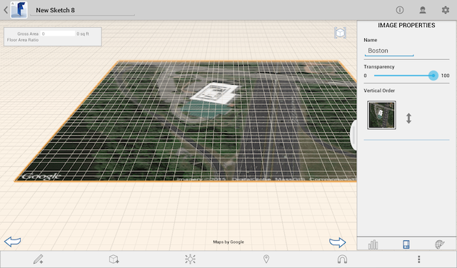

# Bearbeiten, Neuladen oder Entfernen eines Satellitenbilds

---

Sie können Änderungen an den Bildern für Ihren Standort vornehmen.

## Arbeiten mit Satellitenbildern

1. Erneut laden.

2. So entfernen Sie ein Satellitenbild

* Tippen Sie zweimal auf das Bild, und tippen Sie dann auf Standort und anschließend auf Bild entfernen.
* Tippen Sie zweimal auf das Bild, halten Sie den Finger darauf, um das Kontextmenü zu öffnen, und tippen Sie auf X (Löschen).

3. Bildeigenschaften:

Sie können den Namen, die Transparenz oder die Position des Bildes in der vertikalen Anordnung ändern.

