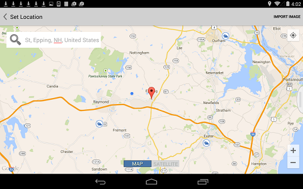

# Festlegen eines Standorts

---

Legen Sie den geografischen Standort für Ihre Skizze fest.

## Standort identifizieren

1. Tippen Sie in der Aktionsleiste auf das Symbol Standort.
2. Suchen Sie den Standort mithilfe des Suchfelds oder der Karte.

3. Tippen Sie in der rechten oberen Ecke auf Bild importieren, um ein Satellitenfoto zu laden.
4. Passen Sie den Zoomfaktor für das Bild an.
5. Tippen Sie auf Bildimport fertig stellen.

