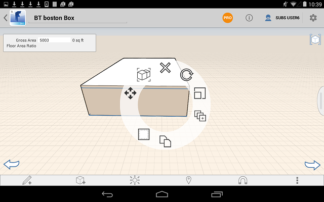
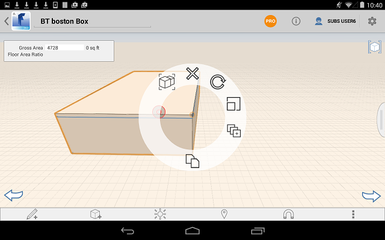

# Kontextmenü und Palette

---

Hier befinden sich die Werkzeuge zum Erstellen und Platzieren von Entwürfen.

## Kontextmenü

* Halten Sie ein Objekt gedrückt, um das Kontextmenü zu öffnen.

* Die im Menü enthaltenen Werkzeuge sind davon abhängig, welche Fläche oder Kante bzw. welches Objekt Sie gewählt haben.

### Objekt-/Materialpalette

* In der Palette auf der rechten Seite des Bildschirms stehen die Registerkarten Gebäudeprogramm, Eigenschaften und Materialien zur Verfügung. 

