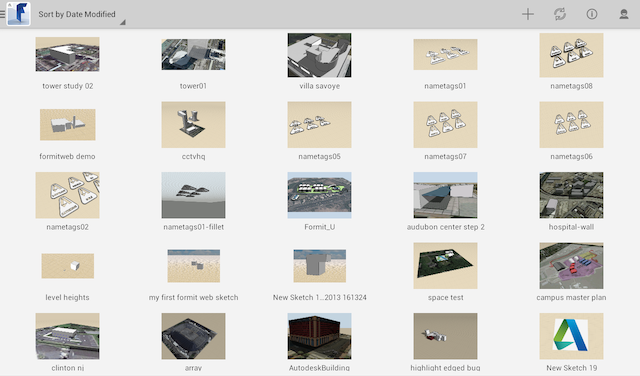

# Referenz zu Projektinformationen

---

Benennen Sie Ihren Entwurf und überwachen Sie seinen Status.

## Bereich Projektinformationen

* Verwenden Sie das FormIt 360-Logo in der linken oberen Ecke, um eine Skizze zu öffnen.

