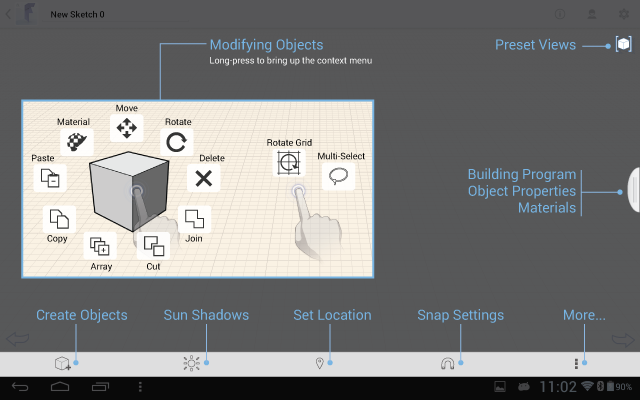

# Benutzerdialog

---

Hier befinden sich die Werkzeuge zum Erstellen und Platzieren von Entwürfen.

Die Benutzeroberfläche der Software nutzt das Standardinteraktionsmodell der jeweiligen Plattform.

* Die wichtigsten Komponenten der Benutzeroberfläche von FormIt sind die folgenden (Tipps zur Interaktion mit der FormIt-Software finden Sie unter Info zu Gesten):

#### Themen in diesem Abschnitt

* [Kontextmenü und Palette](../Context Menu and Palette.md)

Hier befinden sich die Werkzeuge zum Erstellen und Platzieren von Entwürfen.

* [Werkzeuge der Benutzeroberfläche ](../User Interface tools.md)

Referenz zu den Werkzeugen für Befehlsinteraktion.

* [Referenz zu Projektinformationen ](../Project Information Reference.md)

Benennen Sie Ihren Entwurf und überwachen Sie seinen Status.

* [ Gesten](../Gestures.md)

Diese Funktionen stehen für die Interaktion mit der Benutzeroberfläche zur Verfügung.

