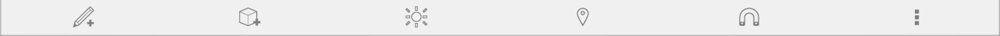

# Werkzeuge der Benutzeroberfläche

---

Referenz zu den Werkzeugen für Befehlsinteraktion.

* Im Menü Ansichtseinstellungen können Sie unter einer Reihe voreingestellter Ansichten wählen. Diese Ansichten ermöglichen eine rasche Visualisierung des Modells mit unterschiedlichen Perspektiven und Zoomfaktoren.
* Die Aktionsleiste befindet sich am unteren Rand des Bildschirms. Die Werkzeuge in der Aktionsleiste ermöglichen das Erstellen, Bearbeiten und Freigeben von Inhalten. 

## Aktionsleiste

* Skizzierwerkzeuge: Klicken Sie hier, um ein Menü mit Erstellungswerkzeugen aufzurufen, mit deren Hilfe Sie Formen zeichnen können.
* Grundkörper: Klicken Sie hier, um ein Menü mit 3D-Grundformen aufzurufen, die Sie in Ihrer Szene platzieren können.
* Beleuchtung und Schatten ändern: Mithilfe dieses Werkzeugs können Sie das Datum und die Uhrzeit ändern.
* Standort festlegen: Sie können einen Standort suchen und Satellitenbilder in Ihre Skizze importieren. Weitere Informationen zum Festlegen des Standorts der Skizze.
* Objektfang: Sie können den Objektfang am Raster aktivieren und deaktivieren.
* Freigeben Ihrer Arbeiten: Sie können Bilder importieren oder sie speichern und per E-Mail versenden.

