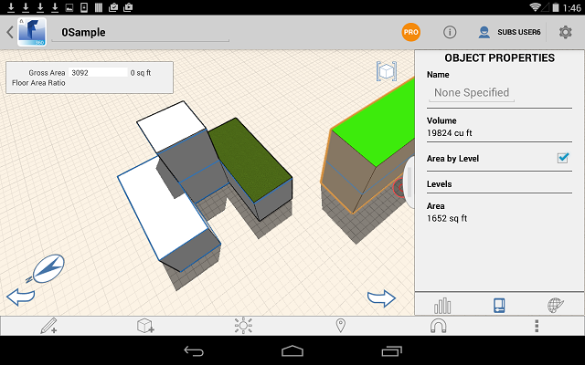
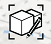
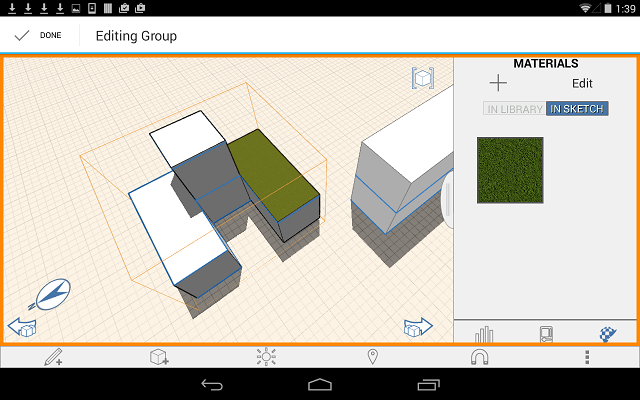

# Anwenden von Ebenen und Materialien auf eine Gruppe

---

Eine Möglichkeit, zahlreiche Objekte gleichzeitig zu bearbeiten.

## Ebenen anwenden

Anmerkung: Im Gruppenbearbeitungsmodus können Ebenen nicht angewendet werden.

1. Wählen Sie ein Objekt aus der Gruppe aus, wechseln Sie jedoch nicht in den Bearbeitungsmodus.
2. Öffnen Sie die Palette Objekteigenschaften.
3. Aktivieren Sie Fläche nach Ebene und wählen Sie Ebenen, um die Höhe für jede Ebene festzulegen.

## Material anwenden

1. Wählen Sie eine Gruppe aus, tippen Sie zweimal, um das Kontextmenü anzuzeigen, und tippen Sie auf Bearbeiten. 
2. Wählen Sie Objekte oder Flächen in der Gruppe.
3. Öffnen Sie die Palette auf der rechten Seite, und zeigen Sie die Registerkarte Materialien an.
4. Tippen Sie auf Materialien, und verwenden Sie ein Material aus der Bibliothek oder, sofern vorhanden, ein bereits für die Gruppe gewähltes Material.

5. Tippen Sie auf Fertig.

