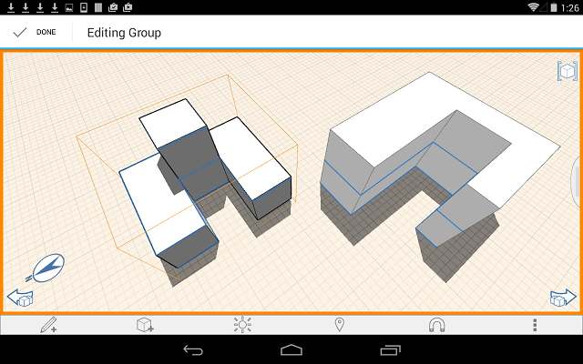

# Gruppe bearbeiten

---

Sie können bestehende Gruppen aktualisieren oder ändern. Anmerkung: Im Gruppenbearbeitungsmodus können Ebenen nicht angewendet werden.

1. Tippen Sie auf die Gruppe, die Sie bearbeiten möchten.
2. Rufen Sie das Kontextmenü auf, und tippen Sie auf das Symbol Gruppe bearbeiten , oder wechseln Sie durch zweimaliges Tippen direkt in den Bearbeitungsmodus.
3. Bearbeiten Sie die Geometrie und damit die Gruppenobjekte.

Im Bearbeitungsmodus können Sie über die Pfeile zum Rückgängigmachen und Wiederholen die jeweils letzte Änderung widerrufen oder erneut ausführen. Wenn Sie den Bearbeitungsmodus beenden, bewirken diese Werkzeuge wie zuvor Änderungen an der gesamten Zeichnung. Sie wirken sich nicht mehr auf die Gruppe aus.

4. Wenn Sie die Bearbeitung abgeschlossen haben, tippen Sie in der linken oberen Ecke auf Fertig.

