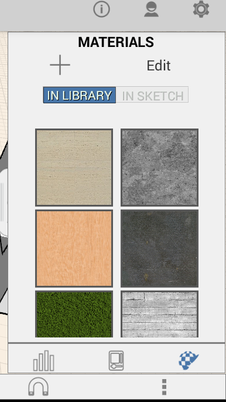
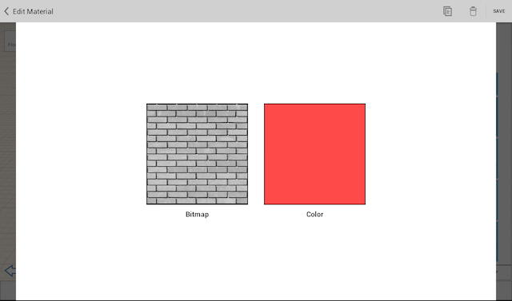

# Arbeiten mit Materialien

---

Mit Materialien arbeiten Sie Ihre Entwürfe detaillierter aus, verbessern sie und gestalten sie ansprechender.

Der Material-Editor befindet sich in der Palette auf der rechten Seite. Im Editor können Sie neue Materialien erstellen und Ihrer Materialbibliothek hinzufügen. Um einem Material eine Farbe zuzuweisen, können Sie entweder mithilfe der Farbwahl den Farbton des Materials präzise festlegen oder ein vordefiniertes Farbfeld wählen.

* Mithilfe von Materialien können Sie Ihre Skizze detaillierter gestalten. Sie können Materialien mithilfe des Material-Editors in der Palette auf der rechten Seite auf Flächen oder ganze Objekte anwenden.

Die Widgets im Material-Editor ermöglichen die folgenden Vorgänge:

* Aktivieren des Pinselwerkzeugs
* Bearbeiten der Farbe oder des Bitmap-Bilds für ein Material
* Kopieren oder Löschen eines Materials

Wenn Materialien auf eine Skizze angewendet werden, werden sie in die Liste der bereits verwendeten Materialien aufgenommen und sind dadurch leichter verfügbar. Für ein Material kann eine Textur (Bitmap) und/oder eine Farbe vorhanden sein. Bei Materialien, die sowohl Textur als auch Farbe aufweisen, werden beide miteinander multipliziert.

* Mit dem Material-Editor können Sie Materialien erstellen oder ändern.

#### Themen in diesem Abschnitt

* [Erstellen, Bearbeiten und Anwenden von Materialien](../Create, Edit, and Apply a Material.md)

Verwenden Sie den Material-Editor, um ein Material einem Objekt oder einer ausgewählten Fläche eines Objekts zuzuweisen.

