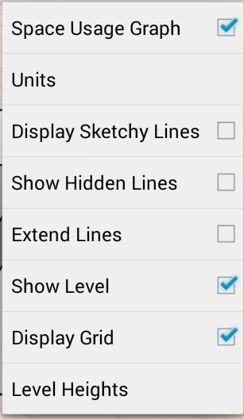

# Optionen für visuelle Formate

---

Beschreibung der Optionen für den Bildstil.

### Bildstiloptionen

| | |
| ---- | ---- |
|  |  Durch Tippen auf das Zahnradsymbol im Werkzeugkasten rufen Sie das Menü Einstellungen auf. Es stehen mehrere Optionen zur Verfügung, die Sie anpassen können:  * Raumnutzungsdiagramm: Anzeige der Statistik unter dem Namen der Zeichnung aktivieren oder deaktivieren * Einheiten: Festlegen der Einheiten für die Skizze: Britisch oder metrisch * Skizzenartige Linien: Umschalter zum Aktivieren oder Deaktivieren der skizzenartigen Linien * Verdeckte Linien anzeigen: Ändern der Darstellung der Skizze durch Aktivieren oder Deaktivieren von Funktionen wie skizzenartigen Linien, verdeckten Linien oder verlängerten Linien * Linien verlängern: Aktivieren oder Deaktivieren der Anzeige verlängerter Linien * Ebenen anzeigen: Einblenden von Ebenen * Raster anzeigen: Aktivieren oder Deaktivieren der Rasteranzeige * Ebenenhöhen: Anzeigen der Höhe von Ebenen.  |

