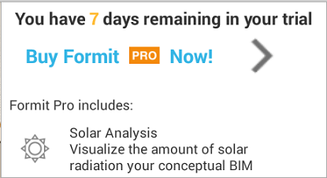
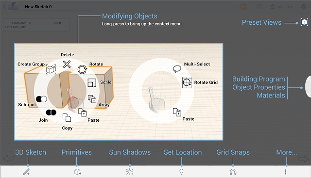

# Willkommen bei Autodesk FormIt 360 und FormIt 360 Pro

---

Lernen Sie Verfahren kennen, mit denen Sie Konzeptentwürfe für Gebäude erstellen und zugleich BIM-Arbeitsabläufe starten können.

Halten Sie Ihre Ideen mit Autodesk® FormIt® 360 sofort in Konzepten für Gebäudeentwürfe fest. Zeichnen Sie diese Ideen in einem portablen digitalen Format auf, in dem Sie mithilfe realer Grundstücksdaten, beispielsweise von Satellitenbildern, Ihre Entwürfe korrekt ausrichten können. Nutzen Sie Gebäude- und Umgebungsdaten aus der realen Welt beim Brainstorming. Übertragen Sie Ihre Vorentwürfe in zentrale Datenspeicher, um mit Autodesk® Revit®-Software oder anderen Anwendungen auf sie zuzugreifen und sie weiterzuentwickeln.

Autodesk® FormIt® 360 Pro bietet zusätzliche Funktionen, darunter:

* Sonnenstudien

Besuchen Sie den [ FormIt 360 YouTube-Kanal](https://www.youtube.com/channel/UCdZJr6Bo4pwBu3lQqcxlDsw), um eine vollständige Liste mit Lernvideos anzuzeigen.

[ Neue Funktionen](https://www.youtube.com/playlist?list=PLqumTDi1CVHPKns2BR_CEap1-y3-xRFZx)

* Kontextmenü

